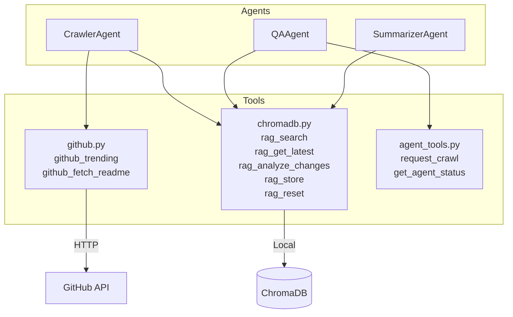
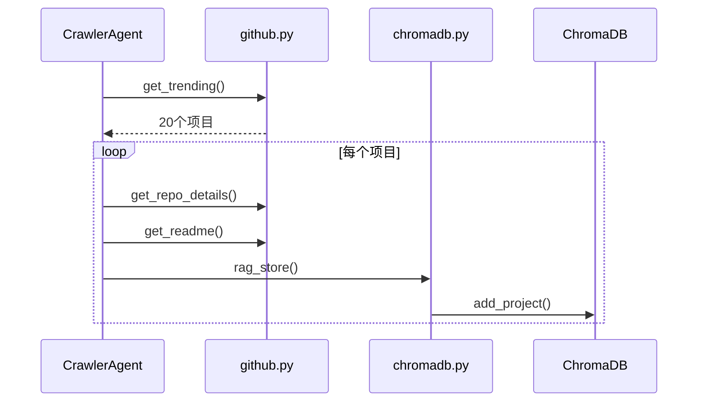
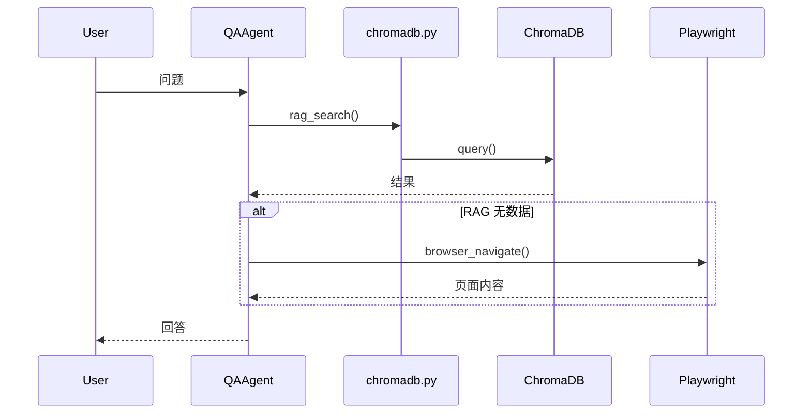
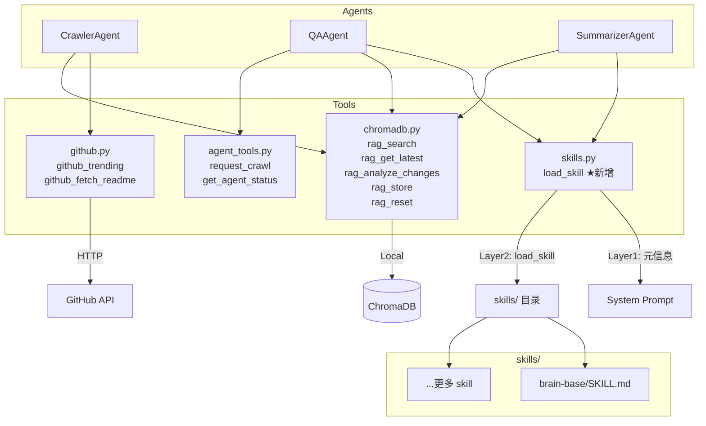
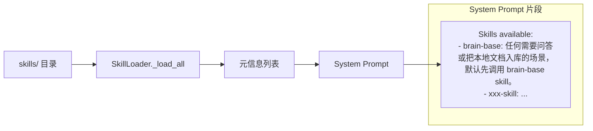
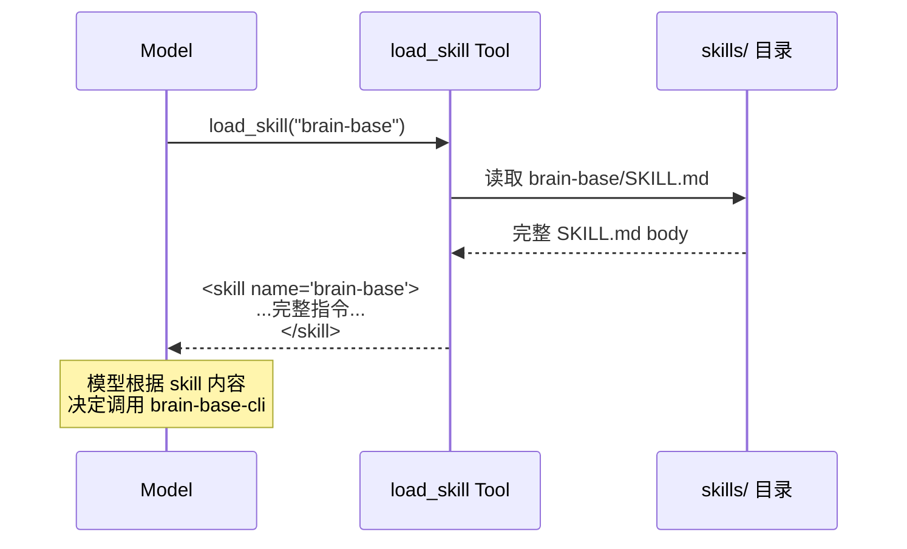
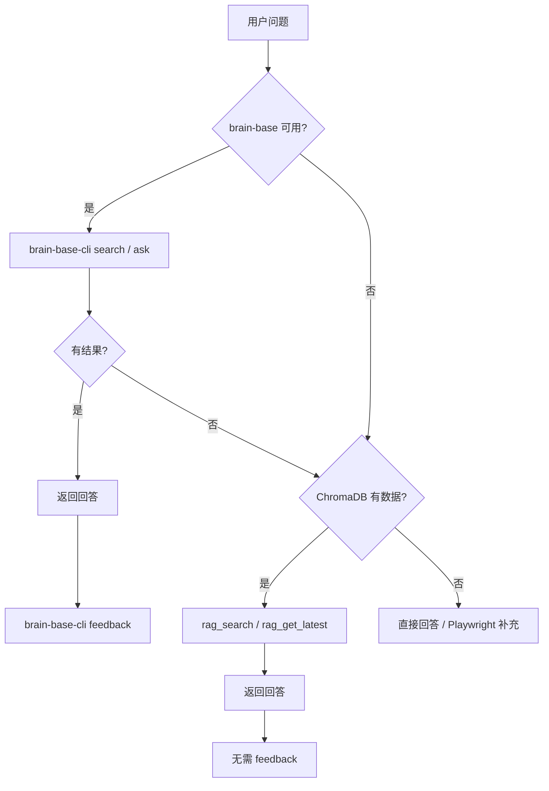
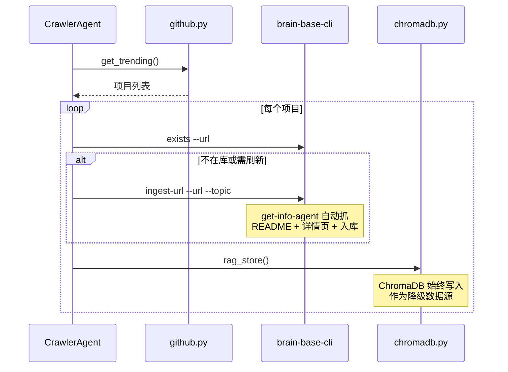
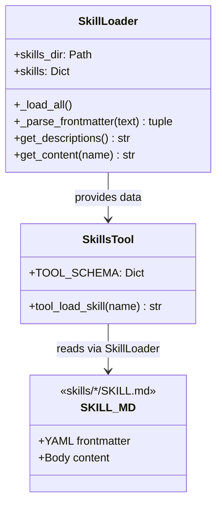
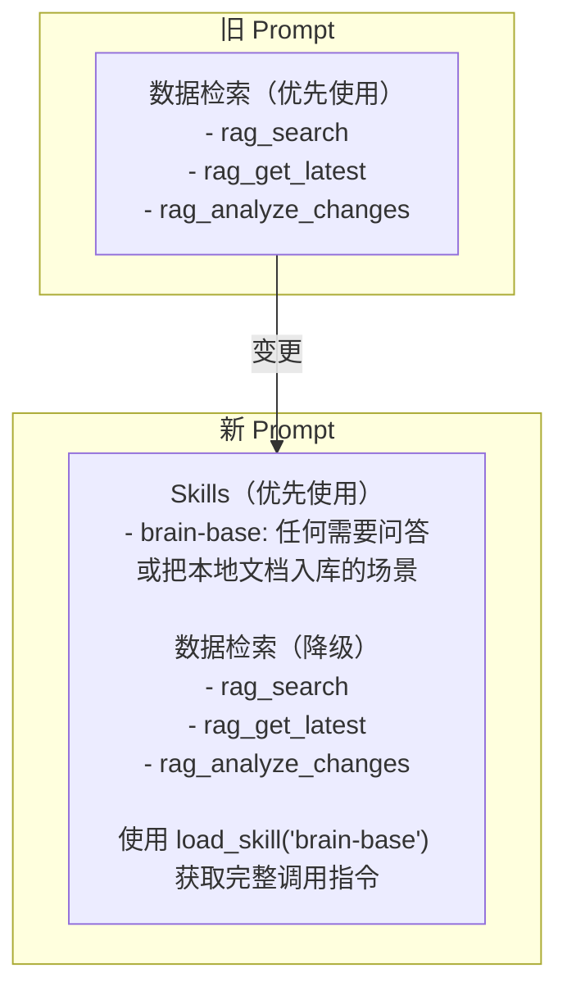

# brain-base 集成设计：Skills Tool 注册机制

## 1. 核心思路

参考 learn-claude-code `s05_skill_loading.py` 的两层 Skill 注入模式：

- **Layer 1**：Skill 元信息（name + description）注入 system prompt，低成本（~100 token/skill）
- **Layer 2**：模型调用 `load_skill("brain-base")` → Tool handler 返回完整 SKILL.md body

这样 github-trending-monitor 的 QA/Summarizer/Crawler 都能通过 Skills 机制接入任意外部能力。brain-base 只是第一个注册的 Skill，后续可以接入更多。

## 2. 旧架构



**数据流**：





## 3. 新架构



**新增 `skills.py`** 是唯一的代码新增点，它实现 `load_skill` Tool，负责：

1. 启动时扫描 `skills/` 目录下所有 `SKILL.md`
2. 解析 YAML frontmatter（name, description, tags 等）
3. 将元信息列表注入 system prompt（Layer 1）
4. 模型调用 `load_skill("brain-base")` 时返回完整 SKILL.md body（Layer 2）

## 4. Skills Tool 两层注入机制

### Layer 1：元信息注入 System Prompt

启动时，SkillLoader 扫描 `skills/` 目录，将所有 skill 的 name + description 拼入 system prompt：



成本：每个 skill 约 100 token，10 个 skill 也只占 ~1000 token。

### Layer 2：按需加载 Skill Body

模型根据 Layer 1 的描述，决定是否需要加载某个 skill 的完整内容：



## 5. 回答链（由 Skill 内容指导模型行为）

brain-base 的 SKILL.md 会指导模型按优先级回答问题：



**关键**：这个优先级链不是硬编码在代码里的，而是写在 `brain-base/SKILL.md` 的指令中，模型读到 skill 内容后自行遵循。如果后续注册了新的 skill（比如 arxiv-skill），只需在 `skills/` 目录下新增 SKILL.md，模型就会自动发现并使用。

## 6. CrawlerAgent 双写

CrawlerAgent 的 `run_crawl()` 也受 brain-base skill 指导：



**CrawlerAgent 不走 `load_skill` Tool**——它是程序化调用，直接在 `run_crawl()` 里 subprocess 调 `brain-base-cli`。Skill 机制主要服务于 QA/Summarizer 这类 LLM 驱动的 Agent。

## 7. 文件改动清单

### 新增

| 文件 | 说明 |
|------|------|
| `src/tools/skills.py` | SkillLoader + load_skill Tool（Layer 1 + Layer 2） |
| `skills/brain-base/SKILL.md` | brain-base skill（从 brain-base 项目复制） |

### 修改

| 文件 | 改动 | 是否主体 | 理由 |
|------|------|----------|------|
| `src/tools/__init__.py` | 导入 SKILLS_TOOLS/HANDLERS，QA_TOOLS 加入 skills | 否（Tools 层） | 标准扩展 |
| `src/agents/qa.py` | QA_PROMPT_BASE 加入 "Skills available" 段落 | 是 | 需要改变 prompt |
| `src/agents/summarizer.py` | tools 加入 SKILLS_TOOLS | 是 | 需要接入 skill |
| `src/agents/crawler.py` | run_crawl() 增加 brain-base-cli 双写 | 是 | 需要改变写库流程 |
| `src/config.py` | 新增 brain_base_dir / skills_dir 配置 | 是 | 需要新增配置 |
| `config.yaml` | 新增 brain_base / skills 配置段 | 否（配置文件） | 标准配置扩展 |

### 不改

| 文件 | 原因 |
|------|------|
| `src/tools/chromadb.py` | 降级保留 |
| `src/tools/github.py` | 爬虫核心能力不变 |
| `src/agents/base.py` | Agent 基类不变 |
| `src/agents/registry.py` | 注册机制不变 |
| `src/channels/*` | 渠道层不变 |
| `src/gateway/*` | 路由层不变 |

## 8. skills.py 核心设计



**SkillLoader** 职责：
- `_load_all()`：扫描 `skills/` 下所有 `SKILL.md`，解析 frontmatter
- `_parse_frontmatter()`：提取 `---` 之间的 YAML 元信息
- `get_descriptions()`：返回 Layer 1 格式化字符串，注入 system prompt
- `get_content(name)`：返回 Layer 2 完整 body，包装在 `<skill>` 标签中

**SkillsTool** 职责：
- 注册 `load_skill` 为 Anthropic tool_use schema
- handler 调用 `SkillLoader.get_content(name)` 返回结果

## 9. QA Prompt 变更



模型在收到问题后：
1. 看到 system prompt 中 "brain-base: 任何需要问答或把本地文档入库的场景"
2. 调用 `load_skill("brain-base")` 获取完整 SKILL.md
3. 根据 SKILL.md 中的指令，优先调用 `brain-base-cli search/ask`
4. 如果 brain-base 失败，降级到 `rag_search`
5. 如果 ChromaDB 也无数据，降级到 Playwright 或直接回答

## 10. 过渡里程碑

### Phase 1：Skills 机制 + brain-base 注册（本次）

- [ ] 新增 `src/tools/skills.py`（SkillLoader + load_skill Tool）
- [ ] 新增 `skills/brain-base/SKILL.md`（复制 brain-base-skill 内容）
- [ ] 修改 `src/tools/__init__.py` 注册 skills tools
- [ ] 修改 QA/Summarizer prompt 和 tools
- [ ] 修改 CrawlerAgent.run_crawl() 双写
- [ ] 修改 config.py + config.yaml
- [ ] 端到端测试

### Phase 2：验证稳定（1-2 周后）

- [ ] 对比 brain-base vs ChromaDB 检索质量
- [ ] 确认 brain-base 入库成功率 > 95%
- [ ] 确认降级路径可用
- [ ] 将 rag_analyze_changes 迁移到 brain-base skill 指令中

### Phase 3：移除 ChromaDB（稳定后）

- [ ] 移除 chromadb.py 依赖
- [ ] QA 完全依赖 skills 机制
- [ ] 清理 ChromaDB 相关配置和依赖

## 11. 后续 Skill 扩展示例

Skills 机制建好后，接入新能力只需在 `skills/` 下新增目录：

```
skills/
├── brain-base/
│   └── SKILL.md          ← 第一个 skill：知识库问答
├── arxiv-search/
│   └── SKILL.md          ← 第二个 skill：论文检索
├── tech-radar/
│   └── SKILL.md          ← 第三个 skill：技术趋势分析
└── ...
```

每个 SKILL.md 的 frontmatter 描述清楚何时触发，模型就会自动在合适场景调用 `load_skill`。
